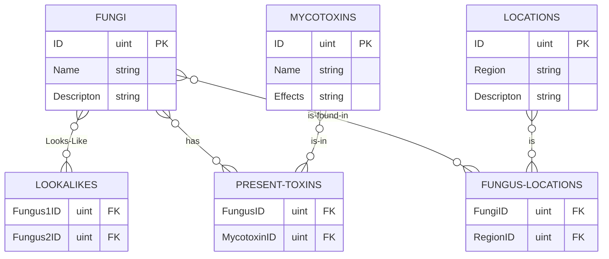

# Wacky-little-my-structured-query-language-final-project-for-one-of-the-various-classes-I-go-to-durin


## ERD



## Installation
``` bash
1. git clone https://github.com/C-Dingus/Wacky-little-my-structured-query-language-final-project-for-one-of-the-various-classes-I-go-to-durin.git

2. cd Wacky-little-my-structured-query-language-final-project-for-one-of-the-various-classes-I-go-to-durin
```

## Dependencies
- mysql-connector-python
- tabulate

## Usage 
To run python menu
``` python
1. python3 main.py
```
To make docker container and create database
```bash
1. docker run --name Wacky-little-my-structured-query-language-final-project-for-one-of-the-various-classes-I-go-to-durin   -e MYSQL_ROOT_PASSWORD=<password>   -p 3306:3306   -d mysql:latest

2. docker start Wacky-little-my-structured-query-language-final-project-for-one-of-the-various-classes-I-go-to-durin

3. docker exec -it Wacky-little-my-structured-query-language-final-project-for-one-of-the-various-classes-I-go-to-durin mysql -uroot -p<password> < schema.sql
```

## Example Usage


## Testing

To add example data and see example queries
``` bash
1. docker exec -it dnd-database mysql -uroot -ppassword < data.sql

2. docker exec -it dnd-database mysql -uroot -ppassword < queries.sql
```
